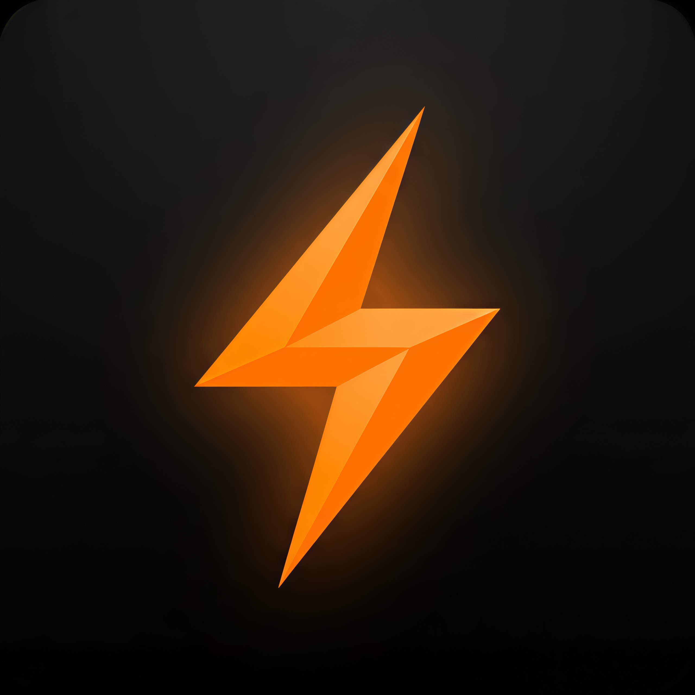

  

<h1 align="center">ApexSense Pro</h1>

  <b>🎮 Rekan Setia Gaming Terbaik untuk Android</b> 
  Overlay Real-time • Kustomisasi Crosshair • Monitor Performa • Optimasi Game

  
  
  

---

## ✨ Tentang ApexSense Pro

**ApexSense Pro** adalah aplikasi utilitas gaming premium yang dirancang khusus untuk meningkatkan pengalaman bermain game di perangkat Android. Dengan antarmuka modern yang futuristik dan performa yang ringan, ApexSense Pro memberikan kontrol penuh kepada pemain untuk mengoptimalkan perangkat dan meningkatkan presisi permainan.

## 🎯 Fitur Unggulan

### 🕹️ Custom Crosshair Overlay
Tingkatkan akurasi tembakan Anda dengan crosshair yang dapat dikustomisasi sepenuhnya dan tetap muncul di atas game apa pun.
- **Berbagai Gaya** — Pilih dari 8 bentuk unik (Cross, Dot, Circle, dll).
- **Kontrol Penuh** — Atur ukuran, ketebalan, warna, transparansi, hingga rotasi.
- **Posisi Fleksibel** — Geser crosshair ke posisi mana pun di layar dengan sentuhan.

### 📊 Session Monitor (HUD)
Pantau kesehatan perangkat Anda secara real-time saat bertempur tanpa harus keluar dari game.
- **Indikator CPU & RAM** — Pantau beban sistem secara instan.
- **FPS Counter** — Pastikan kelancaran game Anda tetap stabil.
- **Info Baterai & Suhu** — Cegah perangkat panas berlebih (overheat) saat push rank.

### 🗃️ Game Vault (Perpustakaan Game)
Kelola semua koleksi game Anda dalam satu wadah yang rapi dan elegan.
- **Deteksi Otomatis** — Game yang terinstal akan otomatis muncul di library.
- **Game Boost** — Urutan peluncuran game yang dioptimalkan untuk performa maksimal.
- **Tampilan Grid Modern** — Navigasi library yang cepat dan memanjakan mata.

### ⚙️ Alat Perangkat Lanjut
- **Sensitivity Engine** — Kalkulator sensitivitas yang disesuaikan dengan resolusi layar Anda.
- **Resolution Changer** — Ubah resolusi layar untuk mendapatkan performa atau kualitas visual terbaik.
- **DPI Tuner (Smallest Width)** — Atur kerapatan antarmuka (UI Density) sesuai keinginan.

---

## 🎨 Desain & Antarmuka
ApexSense Pro mengusung tema **Premium Dark Mode** dengan efek *Glassmorphism* dan aksen **Orange Accent** yang memberikan kesan bertenaga. Antarmuka yang intuitif memastikan semua fitur dapat diakses dengan cepat lewat navigasi swipe yang mulus.

---

## 🚀 Persyaratan Sistem
- Perangkat Android dengan Versi minimal 7.0 (Nougat).
- Izin **"Tampilkan di atas aplikasi lain"** diperlukan agar Crosshair dan Monitor dapat muncul saat Anda bermain game.
- Izin **"Ubah Pengaturan Sistem"** diperlukan untuk fitur pengubah resolusi dan DPI.

---

## 📝 Catatan Penggunaan
Beberapa fitur tingkat lanjut mungkin memerlukan langkah tambahan melalui *Developer Options* untuk memastikan sinkronisasi sempurna dengan sistem Android Anda. ApexSense Pro selalu mengutamakan keamanan dan stabilitas perangkat Anda.

---

  <b>Dikembangkan dengan 🔥 oleh Bara444</b> 
  Kualitas • Presisi • Performa

